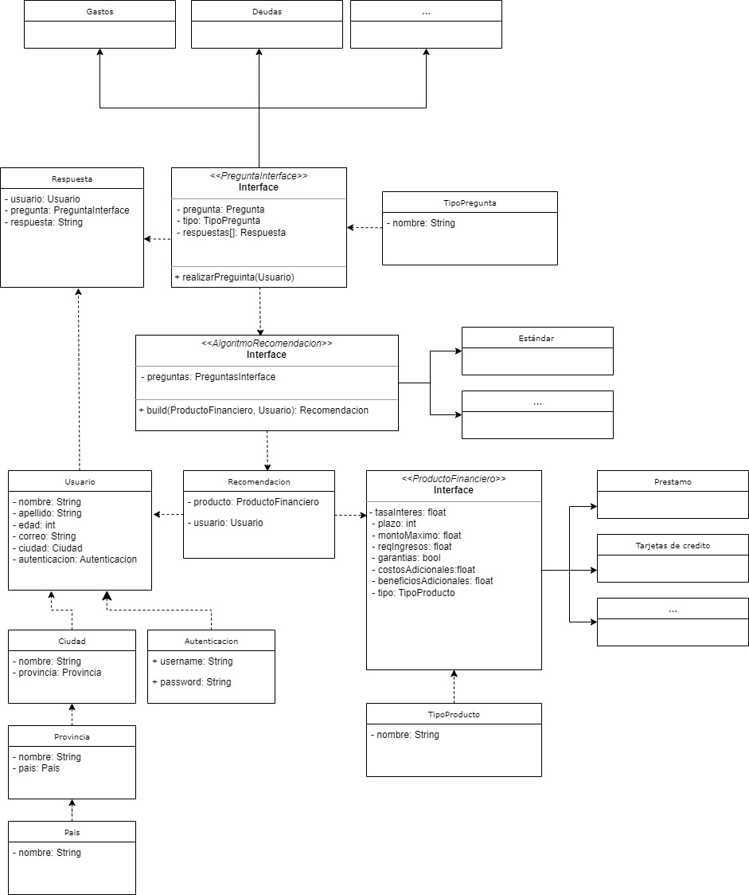

# Dineo Credito Chat-bot Admin

### Init app

`docker-compose up -d`

`composer install`

### DDD
This project is sample stack Domain Driven Design (DDD)

layers:

### UI (User Interface)

View layer:
CLI: ommand ci for console (migrations, etc..)
Api: Endpoint for http request with api rest
Twig: template engine and controller to call to use case application layer
UI

Application (Application Layer with use case)
The use case is the core of the application.

### Appplication

Domain (Domain Layer, with entities and repositories interfaces)
The most important layer is the domain layer. In this layer we have the entities, services and repositories used for application layer.

### Domain

Infrastructure (Infrastructure Layer, with repositories implementations)
The infrastructure layer is the layer that contains the repositories implementations.

### Infrastructure

### Tests
Replicate structure of project with tests

The most important is test in application layer and domain layer. User phpunit for unitary and behat for functional test.

Run the tests with `php bin/phpunit`

###Uml
