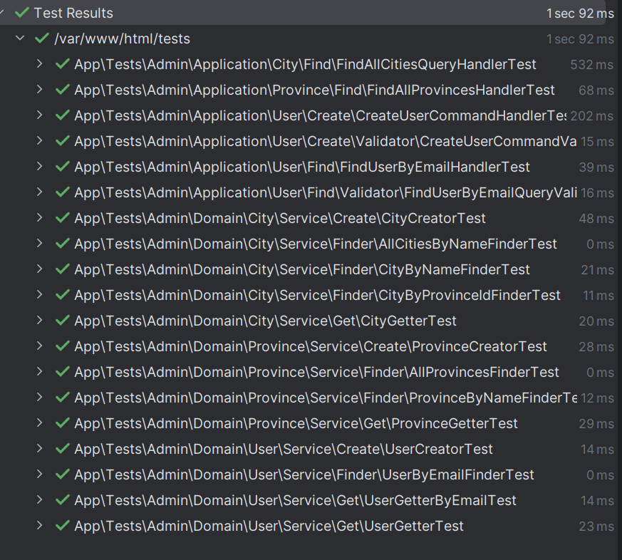

# Dineo Credito Chat-bot Admin

### Init app

`docker-compose up -d`

`composer install`

## DDD
This project is sample stack Domain Driven Design (DDD)

### layers:

In this case in the bundle Admin have the layers domain, application and infrastructure.

### Application (Application Layer with use case)
The use case is the core of the application.

### URL
Admin:
http://localhost/admin

Web:
http://localhost

### Application

Domain (Domain Layer, with entities and repositories interfaces)
The most important layer is the domain layer. In this layer we have the entities, services and repositories used for application layer.

### Domain

Infrastructure (Infrastructure Layer, with repositories implementations)
The infrastructure layer is the layer that contains the repositories implementations.

### Infrastructure

In this layer have the implementation of repositories interfaces from domain for doctrine and postgreSQL, you view docker-composer for more info..

### UI (User Interface)

### View layer:
Twig: template engine and controller to call to use case application layer

## Tests
Replicate structure of project with tests PHPUnit.

The most important is test in application layer and domain layer. User phpunit for unitary and behat for functional test.

Run the tests with `php bin/phpunit` or PHPStorm config with docker-compose:

### Uml
